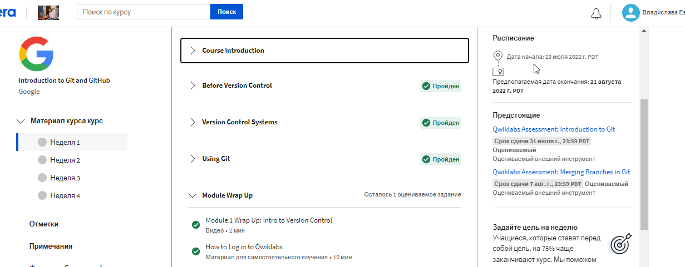
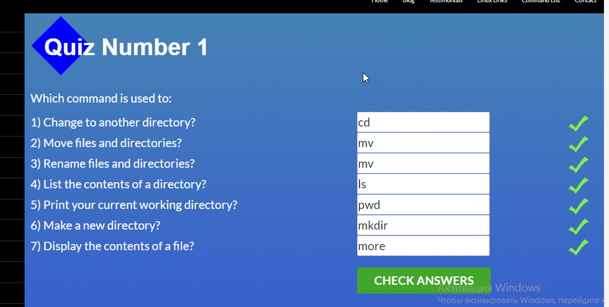
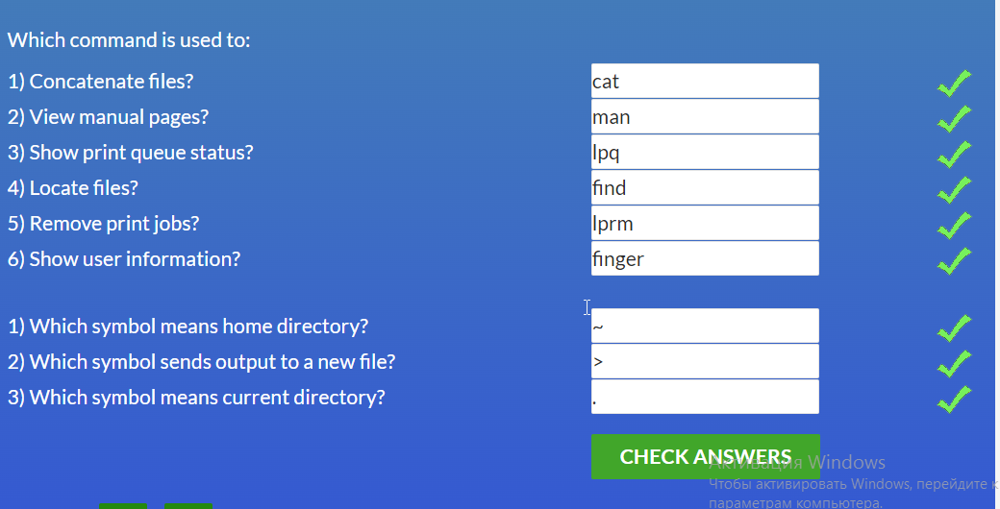
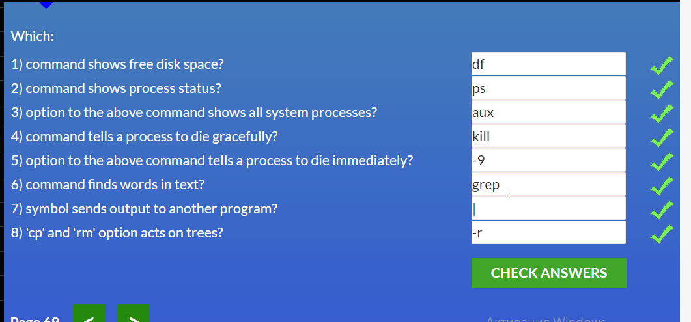

# kottans-frontend
Hi, I'm Vlada. I'm so glad to join Kottans team.)

## Git Basics
Screenshots

 1 week

 2 week

 Learn Git Branching Basic1

 Learn Git Branching Basic2

 Learn Git Branching Remout

### What was new?
I knew new commands and see how it works, because I use it previously(commit, push, reset, pull), but didn't think how it work. It was interesting.

## Linux CLI, and HTTP

Quiz1

Quiz2

Quiz3

Quiz4

### What was new?
All Linux was new.HTTP was interesting.