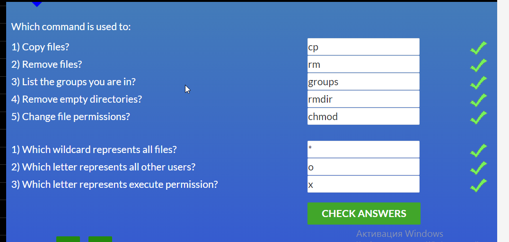

# kottans-frontend
Hi, I'm Vlada. I'm so glad to join Kottans team.)

## Git Basics
Screenshots

 1 week

 2 week

 Learn Git Branching Basic1

 Learn Git Branching Basic2

 Learn Git Branching Remout

### What was new?
I knew new commands and see how it works, because I use it previously(commit, push, reset, pull), but didn't think how it work. It was interesting.

## Linux CLI, and HTTP

Quiz1

Quiz2

Quiz3

Quiz4

### What was new?
All Linux was new.HTTP was interesting.

## Git Collaboration

3 week

4 week

### What was new?
rebase it's a good method for manipulation of commits.

## Intro to HTML and CSS

1 week html

2 week css

tasks html/css

### What was new?
pattern attribute in input was new for me but I have known the rest information. course is small and lector run through the top and css selectors I count other method.

## Responsive Web Design

tasks

### What was new?
I know about grids and use it but a little bit.

## HTML&CSS practice

[Demo](https://vlada-khom.github.io/popup/) |
[Code base](https://github.com/Vlada-khom/popup)

## JS Basics

tasks

### What was new?
As for me regexp in split was new, good practice for understanding reduce but I would like to see more practice on closure and recursion.

## DOM

tasks

## A Tiny JS World

